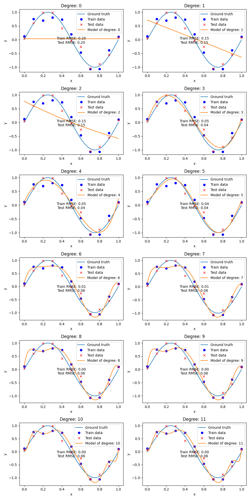
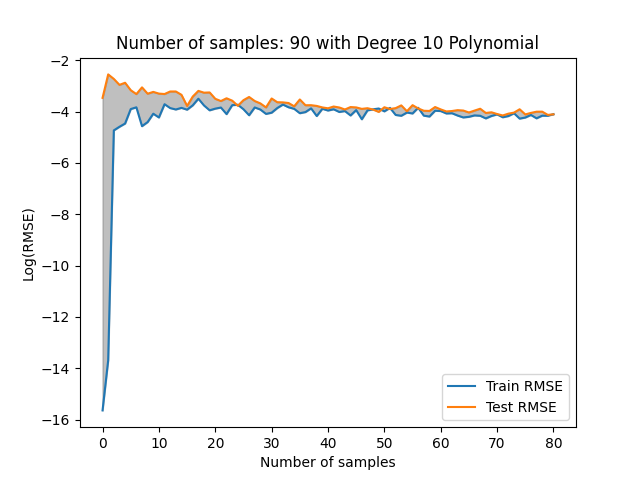

# Exercise 1

Group 5

Task Organization:

**Xinyue Cheng** - 1.2 Polynomial curve fitting

**Junao Li** - 1.2 Polynomial curve fitting

**Yuchen Li** - 1.1 Reading

**Maiqi Zhou** - 1.1 Reading

## 1.1 Reading

This paper introduces an open-source benchmark suite for ultra-low-power tiny machine learning systems. The key contribution is that it is the first readily reproducible industry-standard benchmark suite in this field. 

The MLPerf Tiny framework is a flexible and modular system that accommodates the needs of both hardware and software users. It includes extensive reference implementations that function as standards for the open-source community. Furthermore, this paper discusses about four benchmarks in the suite: Visual Wake Words,  Image Classification, Keyword Spotting, Anomaly Detection, targeting various usecases. 

I fully accept this paper because a standard for performance measurement is essential to keep up with the rapid expansion in the IoT hardware and software industry. Additionally, by the time of this paper's publication, the benchmark presented has already been adopted by the TinyML research community as a standard test set, demonstrating the significant impact of this benchmark.

## 1.2 Polynomial curve fitting


### 1.2.1 *generate data of the shape h(x) = sin(2πx),*

```python
def ground_truth_function(x):

    *# Generate data of the form sin(2 \* Pi \* x)*

    result = torch.sin(2 * np.pi * x)

    return result


```


Use torch.sin to generate ground truth as


The blue point shows training set and x mark shows test set with Gaussian noise level 0.15

and the curve is ground truth value which we want to chase.


### 1.2.2 *Extend the error function to reflect the non-regularized error function from the lecture.*

The error function in lecture is 


$E(w) = \frac{1}{2} \sum_{n=1}^{N} (h(x_n, w) - t_n)^2$


and implement it as 

```python
def error_function(*model*, *x_data*, *y_data*):

    y_pred = *model*(*x_data*)

    error = 0.5 * torch.mean((y_pred - *y_data*) ** 2)

    return error
```

With degree of 3, we can use `np.polynomial.Polynomial` model to generate polynomial model for training data

Result shows


### 1.2.3 *Create a new plot for an overfitted Polynomial of 11-th degree*

In order to get a overfit, use 11 degree

```python
model_degree = 11
model = np.polynomial.Polynomial.fit(x_train, y_train, deg=model_degree)
train_err = error_function(model, x_train, y_train)
test_err = error_function(model, x_test, y_test)
```


and result shows


Obviously, it do fit all data points to get a minimized error value, but it ignore the general scope of whole dataset and we can assume this model parameters lose generalize ability.


### 1.2.4 *Now vary the degree of the Polynomial from 0 to 11.*


We design RSM Error with equation


$E_{RMS} = \sqrt{\frac{2E(w)}{N}}$​


and get code implementation

```python
# Define Root Mean Squared Error function
def rmse(model, x_data, y_data):
    y_pred = model(x_data)
    rmse = torch.sqrt(torch.mean((y_pred - y_data) ** 2))
    return rmse
```




And recorded error shows


for higher degree model polynomial the testing error greater than train set wich mean the model is overfitted, so  more improvement for training needed.


### 1.2.5 *Vary the size of the data, but keep the degree of the Polynomial constant 10*


Generally increase the sample size, and until the RMS Error between train and test set leads to a small enoungh difference

```python
# Starting with 10-th degree polynomial
""" 
Change the sample size of the data until the RMSE difference between the train and test data is less than 0.0001.
Parameters:
    x_train: torch.Tensor
    y_train: torch.Tensor
    x_test: torch.Tensor
    y_test: torch.Tensor
    model_degree: int
    noise_amplitude: float
    n_samples: int
    step_size: int
    
Returns:
    steps: int
    train_err: float
    test_err: float
    n_samples: int
"""
def vary_data_size(x_train, y_train, x_test, y_test, model_degree, noise_amplitude, n_samples, step_size):
    steps = 0
    train_err = []
    test_err = []
    while True:
        steps += 1
        x_train = torch.linspace(0, 1, n_samples)
        y_train = ground_truth_function(x_train) + torch.normal(0., noise_amplitude, size=(n_samples,))
        x_test = torch.linspace(0, 1, n_samples)
        y_test = ground_truth_function(x_test) + torch.normal(0., noise_amplitude, size=(n_samples,))
        model = np.polynomial.Polynomial.fit(x_train, y_train, deg=model_degree)
        train_err.append(rmse(model, x_train, y_train))
        test_err.append(rmse(model, x_test, y_test))
        if abs(train_err[-1] - test_err[-1]) < 0.0001:
            break
        n_samples += step_size

    return steps, train_err, test_err, n_samples
```


and the result can be shown as 



It turns out to be, about 90 samples can concur the overfitting for this task.


### Conclusion

By introducing, larger dataset with more samples or choose proper degree or set a proper error function with good regularization can overcome overfitting to some extend.
