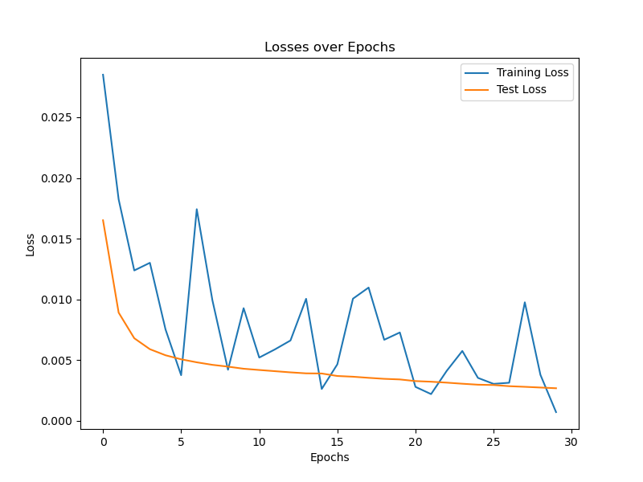
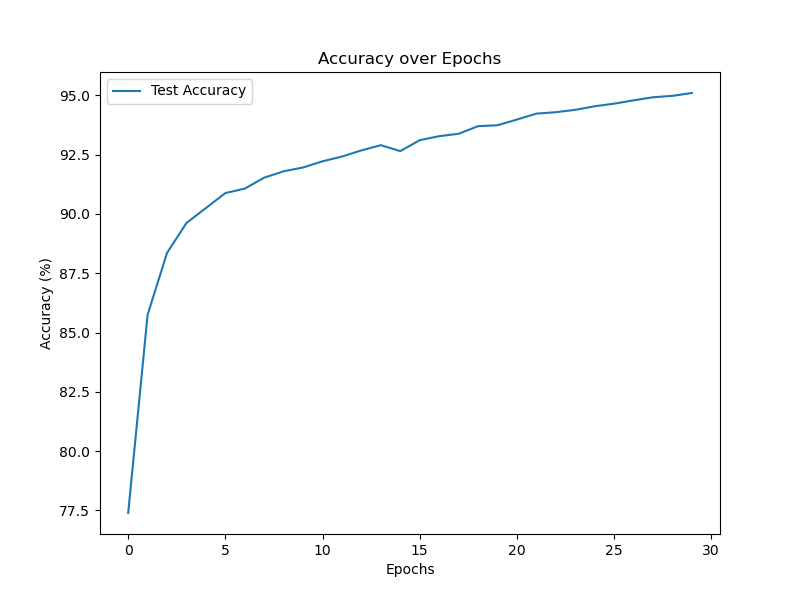
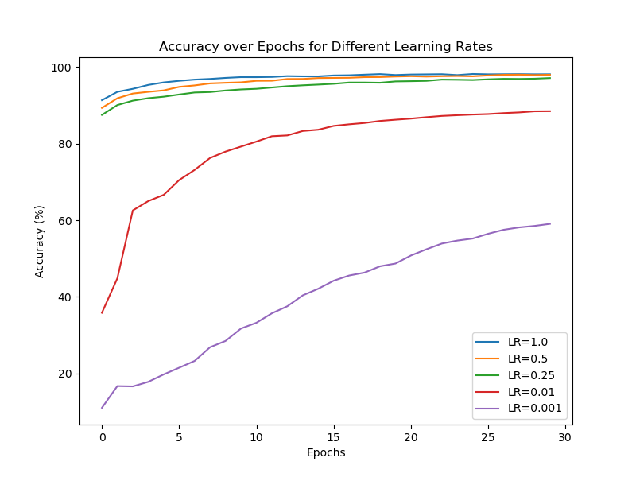

# Exercise 

Group 5

Task Organization:

**Xinyue Cheng** - 2.1 Reading

**Junao Li** - 2.1 Reading

**Yuchen Li** - 2.2 Neural network from scratch

**Maiqi Zhou** - 2.2 Neural network from scratch


## 2.1 Reading

The paper introduces cuDNN, a GPU-accelerated library for deep learning that optimizes critical operations like convolutions, crucial for training CNNs. It integrates seamlessly with frameworks such as Caffe, improving performance by 36% and reducing memory usage. cuDNN supports various NVIDIA GPUs, enhancing computational efficiency and application portability without requiring user adjustments.

The paper details how cuDNN addresses the optimization challenges for deep learning on evolving GPU architectures, focusing on reducing memory overhead, enhancing data movement, and leveraging GPU parallelism. Its flexible, low-level API facilitates integration with multiple frameworks, simplifying the adoption of optimizations and broadening access to performance gains.

I fully accepted this paper because this library is crucial for researchers and developers needing to optimize machine learning operations without deep hardware expertise, making it highly relevant for both academic and commercial AI projects.


## 2.2 Neural network from scratch


### 2.2.1 Extend the Linear layer. 

The Linear class calculates an output y = X * W + b in its forward method. The backward method computes gradients, normalized across the number of input features m, which helps maintain stable update steps. The update method adjusts parameters W (weights) and b (bias) based on these gradients and a learning rate lr.
```python
class Linear():
    def __init__(self, in_features: int, out_features: int, batch_size: int, lr=0.001):
        super(Linear, self).__init__()
        self.batch_size = batch_size
        self.lr = lr
        self.weight = torch.randn(in_features, out_features) * np.sqrt(1. / in_features)
        self.bias = torch.randn(out_features) * np.sqrt(1. / in_features)
        self.grad_weight = torch.zeros(in_features, out_features)
        self.grad_bias = torch.zeros(out_features)
        self.input = torch.zeros(batch_size, in_features)
        self.test = test

    def forward(self, input):
        self.input = input
        output = input @ self.weight + self.bias
        return output

    def backward(self, grad_output):
        m = self.input.shape[1]
        self.grad_weight = 1/m * (self.input.t() @ grad_output)
        self.grad_bias = 1/m * (torch.sum(grad_output, dim=0))
        grad_input = grad_output @ self.weight.t()
        return grad_input

    def update(self):
        self.weight = self.weight - self.lr * self.grad_weight
        self.bias = self.bias - self.lr * self.grad_bias
```

### 2.2.2 Extend the Sigmoid activation function. 
The Sigmoid class in the code computes the sigmoid function on inputs during the forward method, which squashes input values between 0 and 1. In the backward method, it calculates gradients using the derivative of the sigmoid function, multiplied by the gradient from the next layer.

Sigmoid function:
$$\sigma(x) = \frac{1}{1+e^{-x}}$$
derivative of the Sigmoid function: 
$$\frac{d\sigma(x)}{dx} = \sigma(x) \cdot (1 - \sigma(x))$$

```python
class Sigmoid():
    def __init__(self, in_features: int, batch_size: int):
        super(Sigmoid, self).__init__()
        self.input = torch.zeros(batch_size)

    def forward(self, input):
        self.input = input
        output = 1 / (1 + torch.exp(-input))
        return output

    def backward(self, grad_output):
        sigmoid_forward = 1 / (1 + torch.exp(-self.input))
        grad_input = grad_output * sigmoid_forward * (1 - sigmoid_forward)
        return grad_input
```

### 2.2.3 Extend the Softmax function. 
The output of Softmax is a probability distribution over potential outcomes, where every element lies in the range (0,1), and the sum of all these values is 1.

Softmax function:
$$\text{softmax}(x_i) = \frac{e^{x_i}}{\sum_{j=1}^{n}e^{x_j}}$$
```python
def Softmax(input):
    output = torch.exp(input) / torch.sum(torch.exp(input), dim=1).view(-1, 1)
    return output
```

### 2.2.4 Train the network with the given default parameters for 30 epochs. Then plot how the test and train loss develop with the number of epochs. Additionally create a plot, which shows how the test accuracy develops. 

The first graph shows the training loss as a jagged trend with increasing epochs, but overall, it shows a decreasing tendency. The testing loss is consistently decreasing.

The second graph shows the accuracy with increasing epochs increases overall .





### 2.2.5 Run the training again for 30 epochs, but this time with varying learning rates. Choose at least five different learning rates between 1. and 0.001. Create a plot with the test accuracy over epochs to compare the different learning rates. 

This graph presents the accuracy corresponding to different learning rates. Among the learning rates of 1.0, 0.5, 0.25, 0.01, and 0.001, the highest accuracy is achieved with a learning rate of 1.0, while the lowest accuracy is associated with a learning rate of 0.001.


<div align="center">
    
</div>
