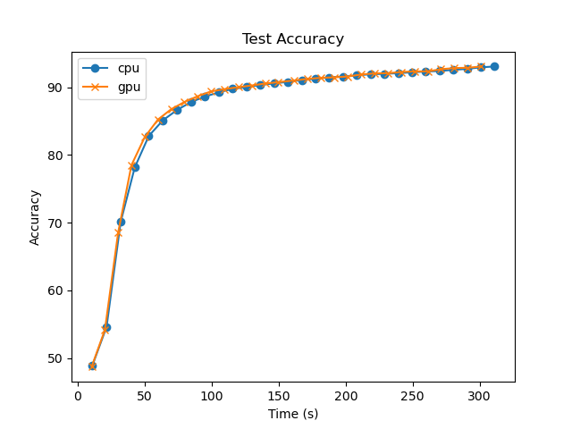
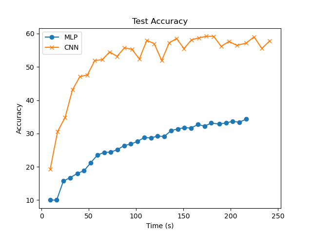
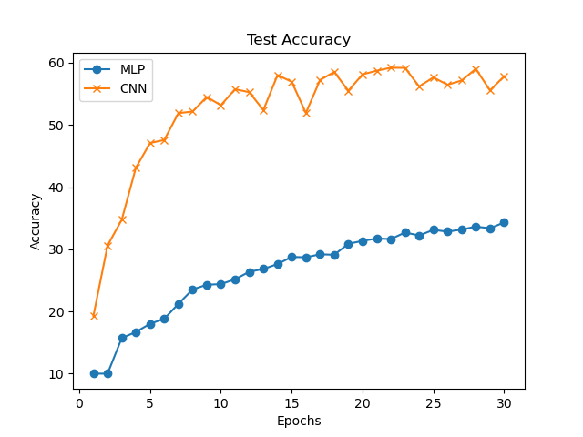
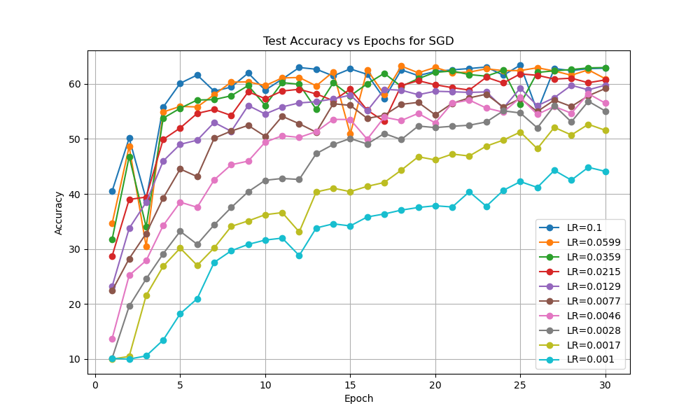
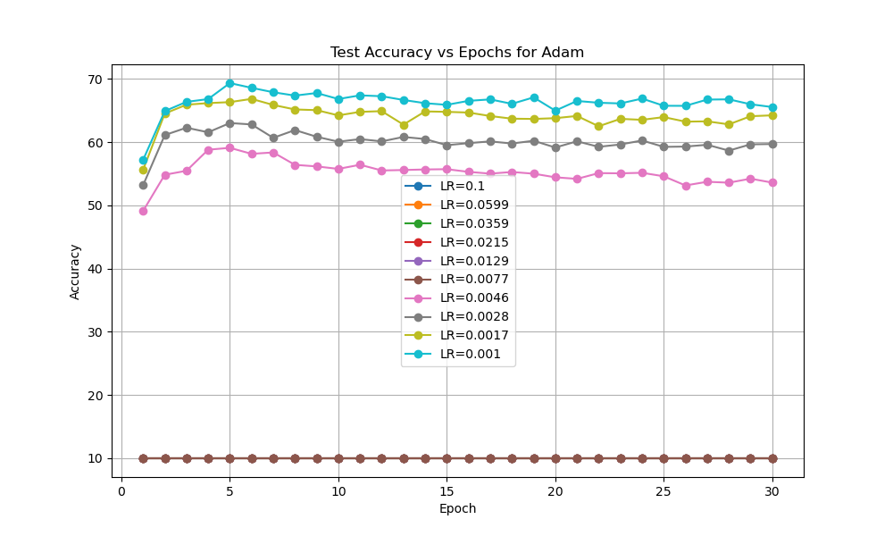
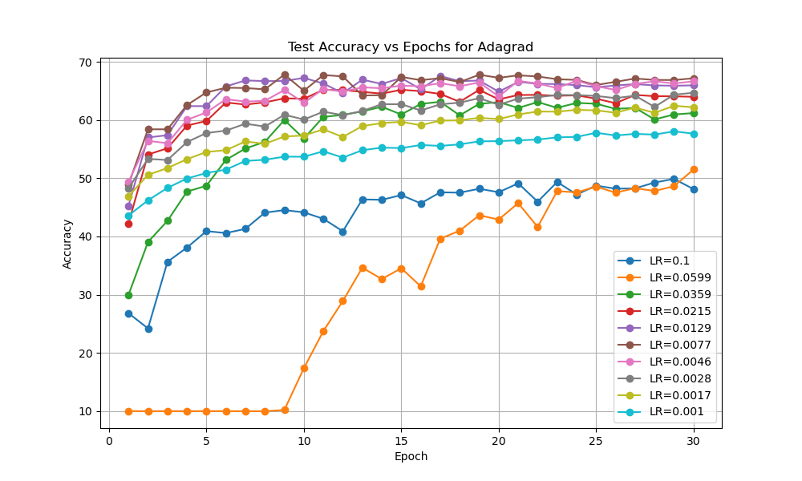
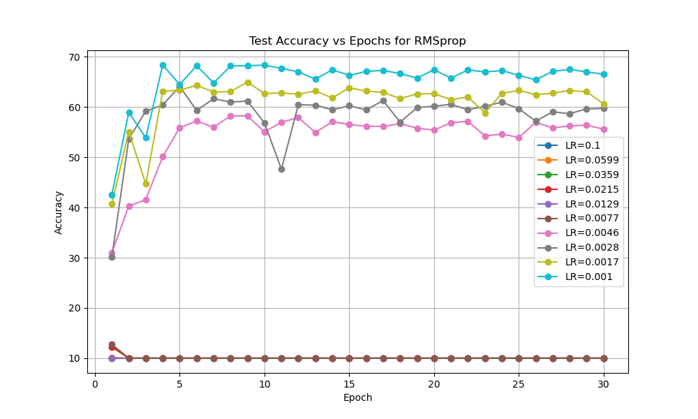
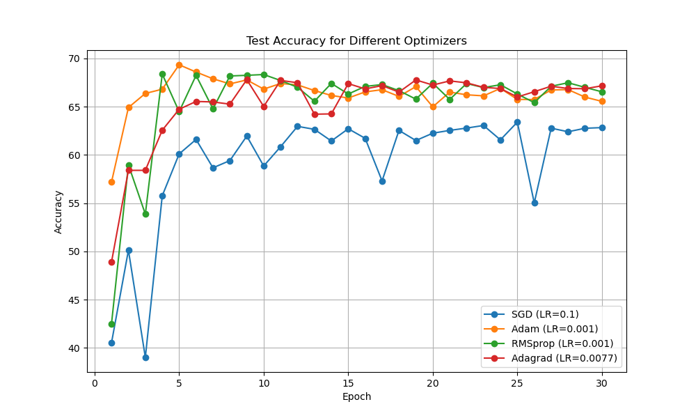

# Exercise 3

Group 5

Task Organization:

**Xinyue Cheng** -  3.1 PyTorch: Automatic differentiation

**Junao Li** -  3.2 MLP and CNN on CIFAR-10

**Yuchen Li** - 3.3 Optimizers

**Maiqi Zhou** - 3.3 Optimizers

## 3.1 PyTorch: Automatic differentiation

We can observe from the figure below that:

- The accuracies of model on CPU and GPU are basically the same.
- The GPU takes less time for an epoch.

Therefore, we can draw a conclusion that  the GPU has an advantage in training time over CPU.

    

## 3.2 MLP and CNN on CIFAR-10

The results of this experiment is shown as follows.

    
    

It can be discovered that the CNN have a much better performance in accuracy but takes slightly more time to train. This suggests the CNN is more capable compared with the MLP when dealing with more complex inputs.

## 3.3 Optimizers

We took logarithmically-scaled learning rates from 0.1 to 0.001. The results is displayed in following figures.

    
    
    
    

It can be observed that the Adam and RMSprop suffer from high learning rates and make no progress during training. Each optimizer has different suitable learning rates in current experimental setting.

In the second part of this experiment, we take a comparative view the best learning rate for each optimizer. 

    

We can see that the Adam has the best performance among all 4 optimizers. It converges to optimum in only 5 epochs and the accuracy is the highest as well. This conclusion consists with what we learned from the lecture.
