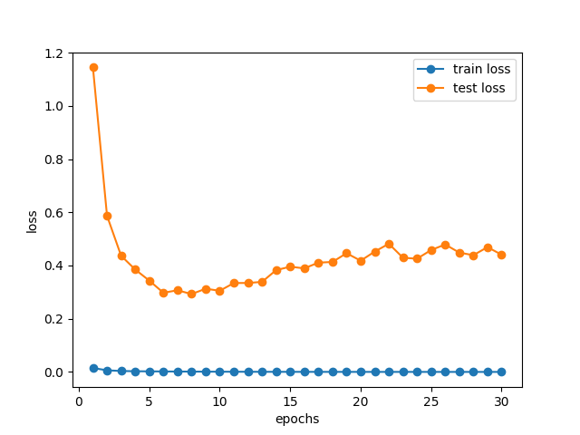
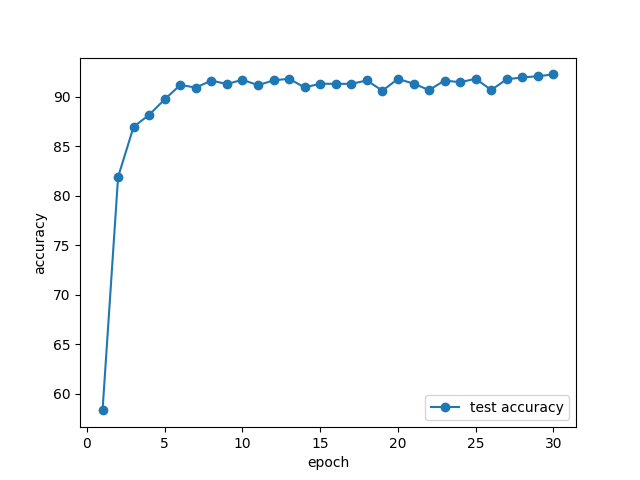
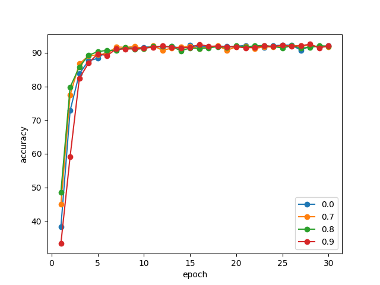
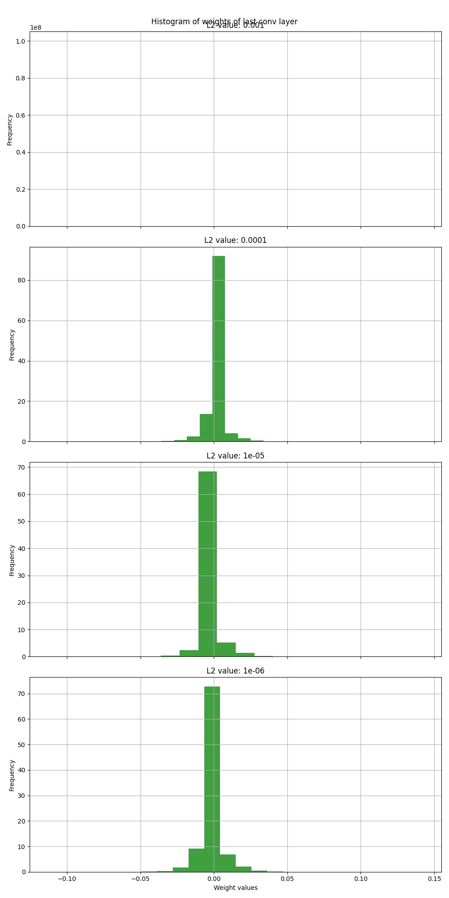
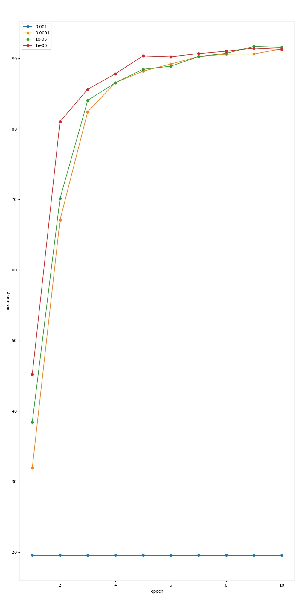
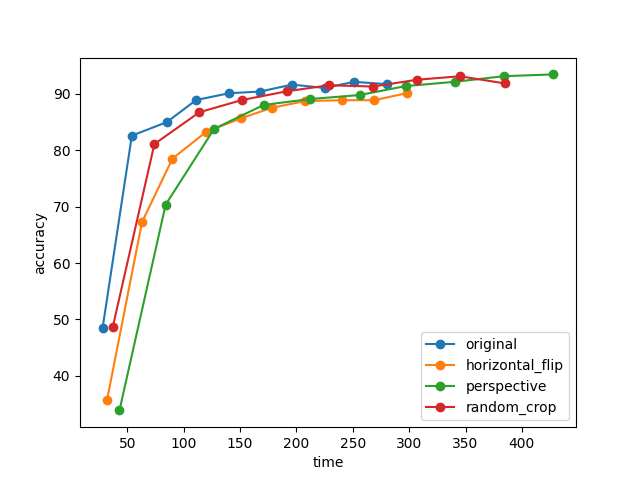
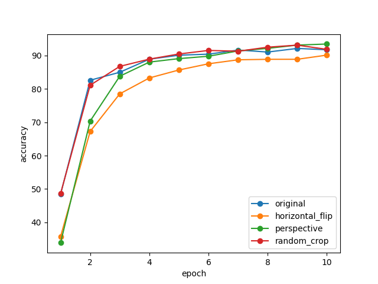

# Exercise 4

Group 5

Task Organization:

**Xinyue Cheng** - 4.1 Regularization: Dropout

**Junao Li** - 4.1 Regularization: Dropout

**Yuchen Li** - 4.2 L2 regularization / weight decay

**Maiqi Zhou** - 4.3 Data Augmentation

## 4.1

#### Graph 1: Training Loss and Test Loss

    

 

From this graph,  we can see the training loss remains very low and stable throughout the training process, almost zero, which means that the model performs well on the training set.
 
For the test loss, it starts high but quickly drops, reaching its lowest point around the 6th epoch. After that, the test loss fluctuates slightly but remains relatively stable with no significant increase or decrease. From the result we can see the model effectively learns the data's features early but may begin to overfit the training data as the training continues, so the test loss to stop decreasing further.
 
Running one epoch on the CPU takes 489 seconds, whereas on the GPU it takes only 23 seconds. This difference is much larger compared to the gap in Exercise 3, indicating that this model is more complex.

#### Graph 2: Test Accuracy

    

 

From this graph, we can see the test accuracy rises rapidly during the first few epochs, after around the 8th epoch, the test accuracy stays stable above 90%.

#### Graph 3: Different Dropout

    

 
For different dropout rates, initially, the accuracy with dropout=0.8 is the highest. However, after around the 7th epoch, there is no significant difference in the results.

## 4.2
#### Graph 1: Weight Histogram

    

 
From this graph, we can see high L2 values (like 0.001) strongly constrain the weights, potentially leading to underfitting. Low L2 values (like 1e-06) have weak regularization effects, which might cause overfitting. Moderate L2 values (like 0.0001 to 1e-05) strike a balance between preventing overfitting and maintaining the model's learning capacity.
 

#### Graph 2: Different L2

    

 
From the graph, we can see that when L2 is 0.001, the accuracy is very low and remains stable. When L2 is 1e-6, the initial accuracy is the highest, but as the epochs increase, it becomes similar to the accuracy of L2 values 0.0001 and 1e-5.

## 4.3

#### Graph 1: Test Accuracy Over Time

    

 

The original and random crop methods reach high accuracy quickly, and horizontal flip also reachs 90% but a bit slower, and perspective transformation takes the longest to reach this accuracy.
 
Overall, the perspective method takes the longest time but achieves the highest accuracy. Compared to horizontal flip and random crop, the original method has higher accuracy and takes the shortest time.

#### Graph 2: Test Accuracy Over Epoch

    

 

From the graph, it can be seen that the accuracy of all methods increases rapidly at the beginning and stabilizes after the 6th epoch. Among all the methods, perspective achieves the highest accuracy, original and random crop are comparable, and horizontal flip has the lowest accuracy.
 
Dropout can help prevent overfitting and make the network more robust. However, because dropout is only applied during training, it might lead to performance discrepancies between training data and test data. When dealing with complex models prone to overfitting, dropout can be very effective.
 
For L2 regularization, it penalizes larger weights, which can also be used to prevent overfitting.
 
For data augmentation, by artificially increasing the size and diversity of the training set, data augmentation helps improve generalization. However, in this experiment, we observed that the result of horizontal flip was not as good as the original method, so we need to choose appropriate methods carefully.

