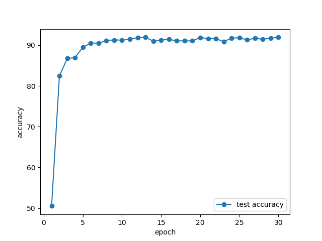
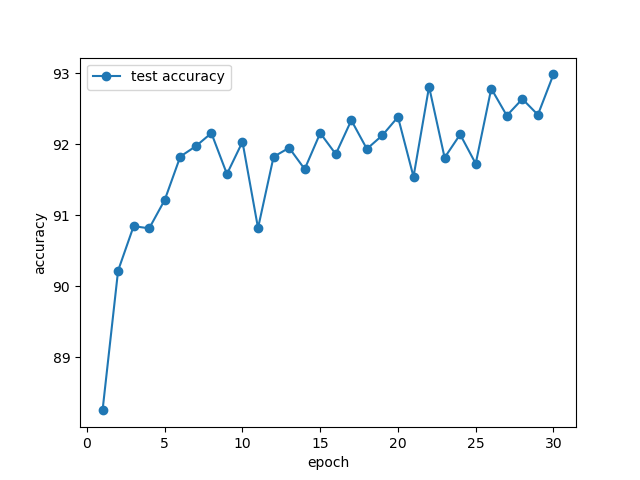
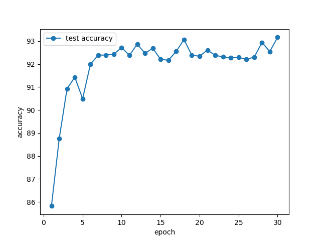

# Exercise 

Group 5

Task Organization:

**Xinyue Cheng** - 5.2 Residual neural network architectures

**Junao Li** - 5.2 Residual neural network architectures

**Yuchen Li** - 5.1 Activation normalization techniques

**Maiqi Zhou** - 5.1 Activation normalization techniques

## 5.1 Activation normalization techniques 

The experiment investigates the impact of different normalization techniques on the test accuracy of a neural network over 30 training epochs. The result of this experiment is displayed in the figures below.

<div align="center" style="display: flex; flex-wrap: wrap; width: 100%;">
      
</div>

<div align="center">From left to right: Without normalization, Batch Normalization and Group Normalization (num_group=32)</div>

1. **Without Normalization**:

   - The network starts with a low test accuracy and quickly improves in the initial epochs.
   - The accuracy stabilizes around 90% after approximately 10 epochs.
   - The plot shows that the accuracy increases rapidly initially but reaches a plateau, indicating the network's limited ability to generalize without normalization.

2. **Batch Normalization**:

   - The network shows a more gradual increase in accuracy compared to the first plot.
   - Test accuracy continues to improve steadily over the entire 30 epochs.
   - The final accuracy reaches around 92-93%.
   - Batch Normalization helps in maintaining a consistent increase in accuracy, indicating better generalization and stability during training.

3. **Group Normalization (num_group=32)**:

   - The network starts with a slightly lower initial accuracy but quickly catches up.
   - The accuracy stabilizes around 93%, similar to Batch Normalization.
   - The fluctuations in accuracy are more pronounced compared to Batch Normalization, but the overall trend shows a steady increase and stabilization.
   - Group Normalization with 32 groups provides a competitive performance similar to Batch Normalization, with the added benefit of being effective for varying batch sizes.

   The experiment demonstrates the importance of normalization techniques in improving the performance and generalization of neural networks, with both Batch Normalization and Group Normalization proving to be effective methods in current experimental setting.

## 5.2 Residual neural network architectures

<div align="center">
    
</div>
## 02 Residual neural network architectures

### Implementation of ResNet

```python
class BasicBlock(nn.Module):
    def __init__(
        self,
        inplanes: int,
        planes: int,
        stride: int = 1,
        norm_layer: Optional[Callable[..., nn.Module]] = nn.Identity,
    ) -> None:
        super().__init__()
        
        # TODO: Implement the basic residual block!
        self.conv1 = nn.Conv2d(inplanes, planes, kernel_size=3, stride=stride, padding=1, bias=False)
        self.bn1 = norm_layer(planes)
        self.conv2 = nn.Conv2d(planes, planes, kernel_size=3, stride=1, padding=1, bias=False)
        self.bn2 = norm_layer(planes)
        self.relu = nn.ReLU(inplace=True)
        self.downsample = None
        if stride != 1 or inplanes != planes:
            self.downsample = nn.Sequential(
                nn.Conv2d(inplanes, planes, kernel_size=1, stride=stride, bias=False),
                norm_layer(planes),
            )

    def forward(self, x: torch.Tensor) -> torch.Tensor:
      
        # TODO: Implement the basic residual block!
        identity = x
        out = self.conv1(x)
        out = self.bn1(out)
        out = self.relu(out)
        out = self.conv2(out)
        out = self.bn2(out)
        if self.downsample is not None:
            identity = self.downsample(x)
        out += identity
        out = self.relu(out)
        return out
```

​	1.	**Convolutional Layers (conv1 and conv2):**

​	•	conv1: The first convolutional layer with a kernel size of 3x3, stride specified by the parameter (default is 1), and padding set to 1 to maintain the spatial dimensions of the input. It increases or decreases the number of channels based on inplanes to planes. It does not use bias terms because batch normalization (applied next) makes the bias redundant.

​	•	conv2: The second convolutional layer also uses a 3x3 kernel, operates with a stride of 1, and padding of 1, keeping the number of channels equal to planes.

​	2.	**Batch Normalization (bn1 and bn2):**

​	•	These layers normalize the outputs of the convolutional layers (conv1 and conv2), stabilizing and speeding up the training process. They work on the planes channels outputted by the convolutional layers.

​	3.	**ReLU Activation (relu):**

​	•	A Rectified Linear Unit (ReLU) is used after each batch normalization to introduce non-linearity into the model, helping it learn more complex patterns.

​	4.	**Downsampling (downsample):**

​	•	If the stride is not 1 or if the number of input planes does not equal the number of output planes, a downsampling layer is applied to the shortcut connection. This layer consists of a 1x1 convolution that adjusts the dimensionality of the input tensor to match that of the output from conv2, allowing for proper element-wise addition. This convolution also operates with the specified stride to reduce spatial dimensions as needed.

​	5.	**Skip Connection**:

​	•	The identity (original input) is added to the output of the second batch normalization layer. This skip connection helps in mitigating the vanishing gradient problem by allowing an alternate shortcut path for the gradient during backpropagation, making deep networks easier to train.

​	6.	**Output**:

​	•	The final output of the block is obtained by applying the ReLU activation to the summed result of the residual connection and the processed output. This results in the final transformed block output.


### Training Result and Network comparison

ResNet: Average loss: 1.34626640625, Accuracy: 7839/10000 (78.3900%)

VGG11: Average loss: 1.5001988647460938, Accuracy: 7542/10000 (75.4200%)

ConvNet: Average loss: 2.325263879394531, Accuracy: 6430/10000 (64.3000%)


* All three models show a decrease in training loss as the number of epochs increases, indicating improvement in learning.

* **ResNet**: It starts with the highest loss but its loss decreases quickly and continuously, ending up with the lowest loss among the three models by the 50th epoch.

* **VGG11**: Begins with a lower loss compared to ResNet, but its rate of loss reduction is slower, eventually surpassing ResNet in loss terms after about 10 epochs.

* **ConvNet**: Has the highest initial loss and maintains a slower decrease in loss throughout the training process compared to the other two models.


The relative time axis shows how much real time each epoch takes for each model, providing insight into the computational efficiency.

* **ResNet**: Even though it starts with a higher loss, it quickly reduces this loss and does so in a shorter amount of relative time compared to VGG11.

* **VGG11**: Although starting with a lower initial loss, VGG11 requires more time per epoch than ResNet, indicating less computational efficiency.

* **ConvNet**: Shows the slowest decrease in loss and also the longest time per epoch, suggesting it is the least efficient model among the three both in terms of learning and computational time.

### Parameters and MAC operations


* **ResNet**: Has a moderate number of parameters, significantly lower than ConvNet. It also requires a lower number of MACs, positioned much below VGG11 and ConvNet, suggesting it is computationally more efficient.

*  **VGG11**: Contains a similar number of parameters to ResNet but requires significantly more MACs, indicating that while it may have a compact parameter set, its computational demand per inference is high.

*  **ConvNet**: Stands out with an exceptionally high number of parameters and MACs, far surpassing the other two models. This suggests it is the most complex and computationally demanding model among the three.


**Analysis:**


* **Efficiency vs. Complexity**: The graph highlights a trade-off between model complexity and computational efficiency. ResNet offers a balanced approach with fewer parameters and MACs, which aligns with its superior performance and efficiency observed in previous training loss comparisons.

*  **Model Suitability**: For environments where computational resources are limited, ResNet presents an attractive option due to its lower computational requirements and efficient performance. On the other hand, ConvNet, despite its potential for high performance, may not be suitable for resource-constrained scenarios due to its high demand for computational power and memory.

*  **VGG11’s Challenge**: Although VGG11 does not have as many parameters as ConvNet, its high number of MACs makes it computationally expensive per forward pass, which could be a disadvantage in real-time applications or devices with limited processing power.
