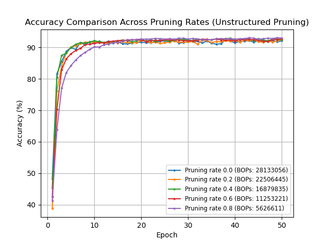
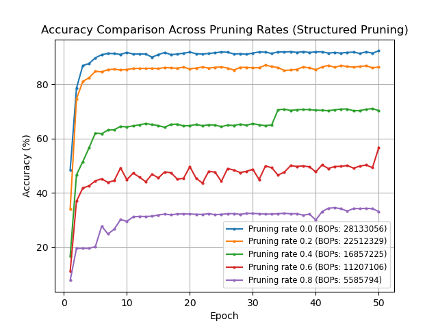

# Exercise

Group 5

Task Organization:

**Xinyue Cheng** - 6.1 Pruning

**Junao Li** - 6.1 Pruning

**Yuchen Li** - 6.1 Pruning

**Maiqi Zhou** - 6.1 Pruning

## 6.1 Pruning

The experiment investigates the impact of 5 different Pruning rates on the test accuracy of a neural network over 50 training epochs. The result of this experiment is displayed in the figures below.

1. **Unstructured Pruning**:

     

Five Different Unstructured Pruning Rates(0, 0.2, 0.4, 0.6, 0.8) on The Test Accuracy

- All pruning rates start at a similar low accuracy around 40%.
  Convergence: Accuracy rapidly increases for all pruning rates and converges after approximately 10 epochs.
- By the end of training (50 epochs), all pruning rates achieve a high accuracy around 92%, with minor variations.
- Impact of Pruning: Higher pruning rates (0.6 and 0.8) slightly delay convergence but do not significantly impact the final accuracy

2. **Structured Pruning**:

     

Five Different Structured Pruning Rates(0, 0.2, 0.4, 0.6, 0.8) on The Test Accuracy

- Higher pruning rates converge slower and to lower accuracies. The unpruned model (pruning rate 0.0) converges the fastest and achieves the highest accuracy.
- Impact of Pruning: Higher pruning rates result in significantly lower final accuracies, showing a clear trade-off between model size (BOPs) and performance.
- Structured pruning negatively impacts model accuracy, with higher pruning rates leading to lower final accuracies.

3. **Shortly discuss: What could be advantages/disadvantages of structured and unstructured pruning?**

- Structured Pruning
- Advantages:

  Hardware Efficiency: Better aligned with hardware, leading to faster inference and lower memory usage.

  Simplicity: Easier to implement and integrate.

  Compatibility: More compatible with parallel processing on GPUs.
- Disadvantages:

  Performance Degradation: Significant accuracy drops if important structures are pruned.

  Coarse Granularity: Less precise control over pruning.
- Unstructured Pruning
- Advantages:

  Fine-Grained Control: More precise pruning at the individual weight level.

  Higher Sparsity: Can achieve greater reductions in model size.
- Disadvantages:

  Irregular Memory Access: Less efficient for hardware accelerators.

  Complex Implementation: Harder to implement and optimize.

  Limited Hardware Support: Not as well supported by current hardware architectures.
